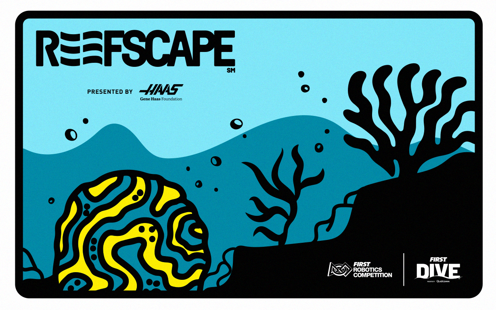

# FRC2025

This is 5160's 2025 robot code.

### Tech stack:
- Java + lombok(kotlin cope)
- TypeScript + React native for operator UI
- MapleSim
- Epilogue + custom monologue fork for manual logging
- AdvantageScope
- ChoreoLib
- Phoenix6, REVLib, PhotonLib, etc.

### Important Folders
- src/main - RIO robot code
- operator-ui - Operator UI code
- advantagescope-assets - Common assets folder for 3d models/layout

### To-do
- Get climber + climber pathfinding worked out
- Github CLI(event deploy, run tests, etc)